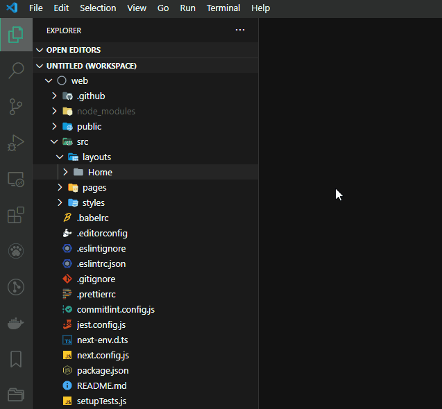
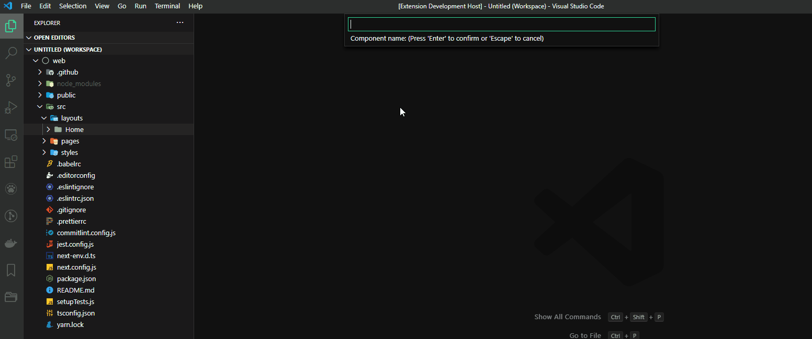
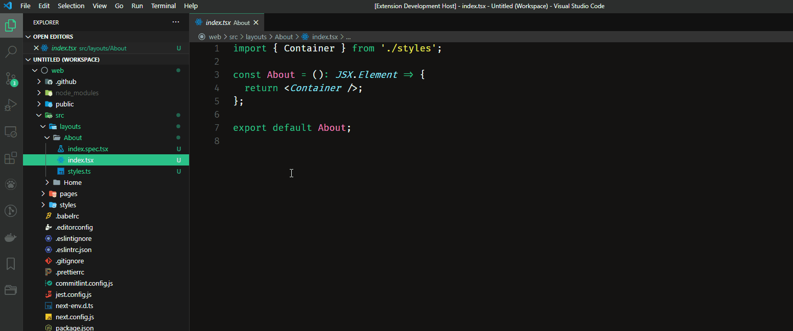

# Synxty Components

>Create your React components right from the explorer!

## 👉🏼 About

This extension goes along with the [Create Synxty App](https://www.npmjs.com/package/create-synxty-app) tool chain. Try it and start your projects like a pro with next.js, eslint, prettier, jest, styled-components and more right out of the box!

## 📃 Installation

- From the Quick Open dialog:
  1. Open [Visual Studio Code](https://code.visualstudio.com/)
  2. Press `Ctrl+P` to open the Quick Open dialog
  3. Type `ext install synxty-components` to find the extension
  4. Click the `Install` button, then the `Enable` button  

- From the extension tab:
  1. Press `Ctrl+Shift+X` to open the Extensions tab
  2. Type `synxty components` to find the extension
  3. Click the `Install` button, then the `Enable` button

- From the command line:
  1. Open a command-line prompt
  2. Run `code --install-extension synxty.synxty-components`  

## 🎨 Creating a Component

1. Inside your react application directory, right click the folder where you want to create your component, like this: 

2. Then, give your component a name. What you type is going to be trimmed, capitalized and spaces will be removed. 

3. And just like that your react component is created with a spec and a style file to go with it! 

**Notes:**

- This example shows the creation of a next.js component. The only difference is that you don't need to import react.
- You can also run this extension from the command palette: type `crate a react component` or `crate a next component`.

## ⚖️ License

This extension is open source software [licensed as MIT](LICENSE).
___

Thank you, made with 💗 by [Synxty](https://github.com/synxty).
